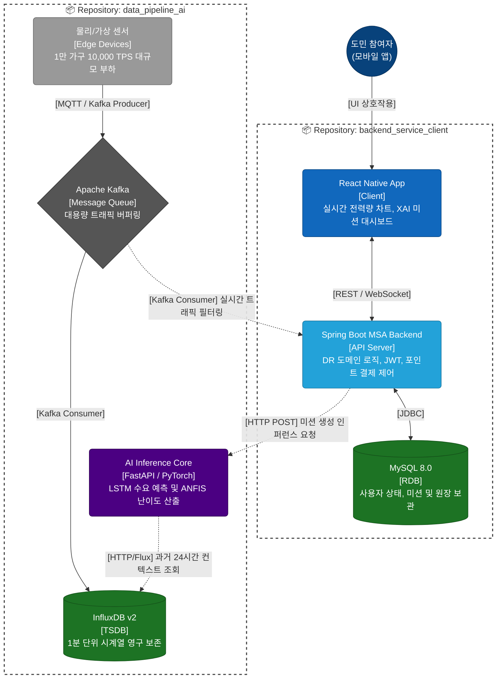

# 감자전력공사 

강원특별자치도 2040 탄소중립 실현을 위한 [도민 참여형 수요 반응(DR) 및 맞춤형 보상 플랫폼] 프로젝트의 공식 깃허브 공간입니다. 
2개의  리포지토리로 분리되어 있습니다.

---
 

## 1. 평가 및 시연 가이드
  프로젝트의 백엔드 및 AI 인프라는 현재 AWS EC2 클라우드 환경에서 가동 중입니다. 
다음의 앱(APK)만 설치하여 전체 시스템을 체험해 보실 수 있습니다.

### ※ 1만 가구 규모 데이터를 생성하는 가상 에지 기기 계속 가동하다가 EC2 인스턴스가 뻗어서 조치중입니다. 불편을 드려 죄송합니다.

## 1.1. .apk파일 설치
아래 링크를 클릭하거나 QR 코드를 스캔하여 테스트 기기(안드로이드 실물 스마트폰 또는 에뮬레이터)에 앱을 설치해 주세요.
### 1.1.1. PC 환경 (Android Studio)
## [다운로드 링크](https://github.com/capstoneknu/.github/releases/download/v1.0.0/EnergyDemandResponse_v1.apk) 
 

### 1.1.2. QR코드

  

### 1.1.3. 테스트 계정
| ID | kim@energy.com | password | 1234 |
| :---: | :---: | :---: | :---: |

---
 

## 2. Repositories 
아래의 링크를 클릭하여 각 파트별 상세 구조와 소스코드를 확인하실 수 있습니다.

1️⃣ 데이터 파이프라인 및 인공지능 코어 ➔ [담당자: 김수영](https://github.com/capstoneknu/data_pipeline_ai.git)

- 저장소명: data_pipeline_ai

- 주요 역할: 1만 가구 규모의 실시간 스마트 미터 데이터를 수집하고, 인공지능이 전력 수요 예측 및 맞춤형 난이도를 산출합니다.
  

2️⃣ 백엔드 비즈니스 로직 및 모바일 클라이언트 ➔ [담당자: 함동관](https://github.com/capstoneknu/backend_service_client.git)

- 저장소명: backend_service_client

- 주요 역할: 모바일 앱을 통해 사용자에게 인터페이스를 제공하고, 웹소켓 통신 및 회원/미션/포인트 비즈니스 로직을 총괄합니다.
---
  
## 3. Team 구성원

| 김수영 | 함동관 |
| :---: | :---: |
| **Data Pipeline & AI Architecture** | **Backend & Mobile Client** |
| 인공지능(LSTM/ANFIS) 모델링   Kafka 분산 메시징 인터페이스 설계   InfluxDB 시계열 데이터 파이프라인 구축  | Spring Boot 설계   React Native 모바일 앱 구현  보상 로직 및 시스템 통합 연동  |
---
  
## 4.Repositories & System Architecture Overview

시스템 전체를 아우르는 에지-AI 융합 분산 아키텍처 조감도입니다.

  
---

